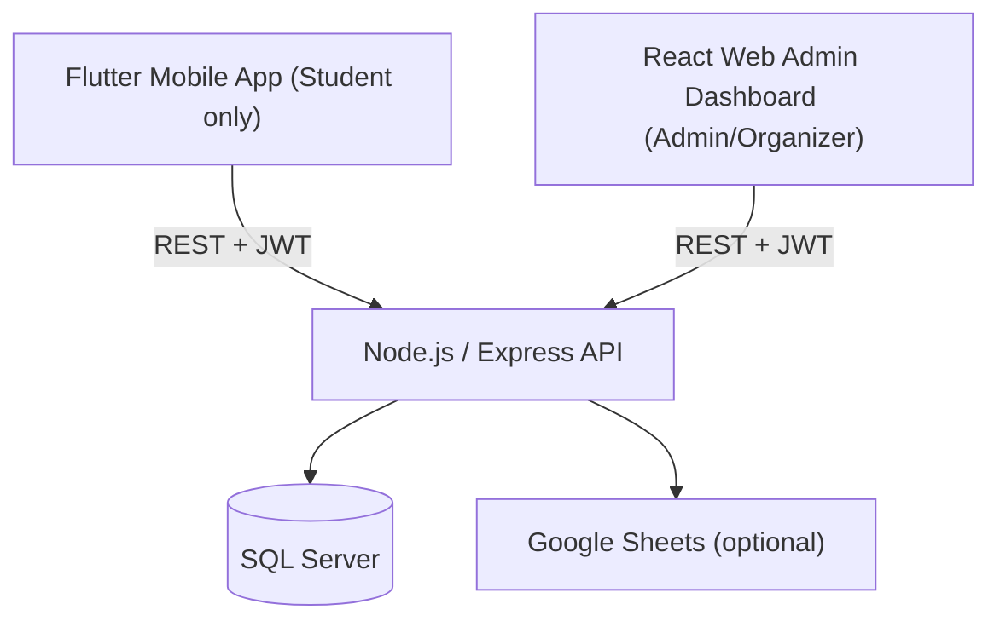

# QR-Based Student Event Attendance System

Production-oriented QR attendance system with a **student-only Flutter mobile app**, a **Node.js/Express REST API**, and a **React (Vite) web dashboard** for admins/organizers.

> **Roles**
> - **1 = admin**
> - **2 = organizer**
> - **3 = student**
>
> **Policy**: Mobile app must allow **ONLY student** role. Admin/organizer must use the **web dashboard**.

---

## Project overview

This system allows students to browse events, register, and present a QR token at the event. Admins/organizers use the web dashboard to scan QR codes and record attendance. The backend optionally integrates **Google Sheets** per event for participant/attendance tracking.

---

## System architecture



### Data flows

1) **Student login**
- Mobile → `POST /api/auth/login` with header `X-Client: mobile-app`
- API verifies credentials and **rejects non-student roles** for mobile
- API returns `{ token, user }`
- Mobile stores token and user locally (student-only)

2) **Student registers for an event**
- Mobile → `POST /api/events/:id/register` (JWT required)
- API creates/updates a `registrations` record with a **unique `qr_token`**
- API returns `qr_token` (and a QR image data URL in response)
- API may append the student row into the event’s Google Sheet

3) **Student shows QR**
- Mobile renders `qr_token` as a QR image

4) **Organizer scans QR**
- Web Admin uses camera scanner
- Web Admin → `POST /api/attendance/scan-qr` (JWT required; **admin/organizer only**) with `{ qr_token }`
- API extracts token if a full QR payload is provided, then checks registration

5) **Attendance recorded**
- API inserts into `attendances` and marks `registrations.status = 'attended'` inside a DB transaction
- API may update Google Sheets attendance status (non-blocking)

---

## Technology stack

### Backend (`event-system/`)
- Node.js + Express
- SQL Server (`mssql`)
- JWT auth (`jsonwebtoken`), password hashing (`bcrypt`)
- Security: `helmet`, rate limiting (`express-rate-limit`)
- Validation: `express-validator`
- Logging: `morgan` + `winston`
- API docs: Swagger (`swagger-ui-express`, `swagger-jsdoc`)

### Mobile (`mobile-app/`)
- Flutter (Dart)
- HTTP client: `http`
- Local storage: `shared_preferences`
- QR rendering: `qr_flutter`

### Web Admin (`web-admin/`)
- React + TypeScript
- Vite
- Tailwind CSS
- HTTP client: Axios
- QR scanning: `react-qr-reader`

---

## Folder structure

```text
event-system/        Node.js + Express REST API
mobile-app/          Flutter student application (student-only)
web-admin/           React admin/organizer dashboard
docs/                Project documentation (API, architecture, etc.)
```

---

## Database schema (SQL Server)

Source: `event-system/database.sql`

### Core tables
- **`roles`**: `admin`, `organizer`, `student`
- **`users`**: accounts; includes `role_id`, `is_active`
- **`event_categories`**: category metadata
- **`events`**: event info; includes `created_by`, `max_participants`, optional Google Sheets columns
- **`registrations`**: join between user and event; stores unique **`qr_token`** and `status` (`registered|attended|cancelled`)
- **`attendances`**: one-per-registration attendance record (`registration_id` unique)
- **`refresh_tokens`**: reserved for refresh-token flow (not fully implemented yet)
- **`audit_logs`**: reserved for audit trail

### Relationship highlights
- `users.role_id → roles.id`
- `events.created_by → users.id`
- `registrations.user_id → users.id`
- `registrations.event_id → events.id`
- `attendances.registration_id → registrations.id`

---

## Setup instructions (local dev)

### Prerequisites
- Node.js (LTS recommended)
- Flutter SDK
- SQL Server (local) or Docker

### 1) Backend (API)

From `event-system/`:

```bash
npm install
cp .env.example .env
npm run dev
```

If you prefer Docker (SQL Server + backend):

```bash
docker compose up --build
```

Initialize DB schema:
- Run `event-system/database.sql` against your SQL Server instance (e.g., SSMS / Azure Data Studio).

### 2) Web Admin

From `web-admin/`:

```bash
npm install
npm run dev
```

### 3) Mobile app (Flutter)

From `mobile-app/`:

```bash
flutter pub get
flutter run
```

> Note: `mobile-app/lib/config/api_config.dart` currently contains a hardcoded base URL for non-web builds. For teams and production, use env/flavors (see “Improvements”).

---

## API endpoints overview (high level)

Base: `/api`

### Auth
- `POST /auth/register` (student registration; role is forced to student)
- `POST /auth/login` (JWT login; mobile includes `X-Client: mobile-app`)

### Events
- `GET /events` (public, paginated)
- `GET /events/:id` (public)
- `POST /events/:id/register` (student)
- `DELETE /events/:id/register` (student)
- `GET /events/organizer/events` (admin/organizer)
- `POST /events` (admin/organizer)
- `PUT /events/:id` (admin/organizer)
- `DELETE /events/:id` (admin/organizer)
- `GET /events/:id/registrations` (admin/organizer; participants)
- `GET /events/event/:id/members` (admin/organizer; registrations list)

### Attendance
- `POST /attendance/scan-qr` (admin/organizer)
- `GET /attendance/event/:id` (admin/organizer)

Full details: see `docs/API.md`.

---

## Screenshots

Add screenshots/gifs here:

- `docs/screenshots/mobile-login.png`
- `docs/screenshots/mobile-event-list.png`
- `docs/screenshots/mobile-qr.png`
- `docs/screenshots/web-dashboard.png`
- `docs/screenshots/web-qr-scan.png`

---

## Contribution guide

- Create a feature branch from `main`
- Keep changes scoped and add tests where feasible
- Run:
  - Backend: `npm test` (from `event-system/`)
  - Web admin: `npm run build` (from `web-admin/`)
  - Mobile: `flutter analyze` (from `mobile-app/`)
- Open a PR with:
  - Summary
  - Screenshots (UI changes)
  - Test plan

---

## License

MIT (recommended). Add a `LICENSE` file at the repository root to make it explicit.

